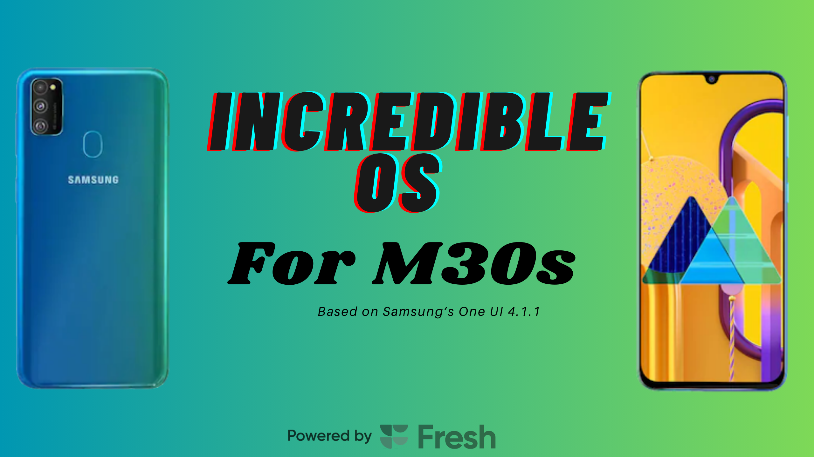

# Incredible OS - Android 12 (One UI 4.1.1) for Samsung Galaxy M30S

  

## Overview

Samsung may have abandoned software support for the Galaxy M30S, but that doesn't mean this device has to be left behind. **Incredible OS** breathes new life into the **Samsung Galaxy M30S** by bringing **One UI 4.1.1**, packed with modern features, optimizations, and improvements. This ROM is based on the **Samsung Galaxy A51 firmware**, ensuring a fast, smooth, and stable experience that surpasses stock performance.

✨ **Incredible OS** ✨  
📱 **Samsung Galaxy M30S**

👤 **Owner & Developer:** @Dhiren9611  
⚙️ **Base:** Galaxy A51 (One UI 4.1.1)  

---

## ⚠️ WARNING ⚠️
🚫 **Unauthorized use or re-uploading of this ROM is strictly prohibited!** 🚫

---

## 📦 Download
IncredibleOS is Finally Available for Download [Click Here](https://drive.google.com/file/d/1q99CK4kRSzJuu4FVQ4kmQWi6WLDLg3vM/view?usp=sharing)

---

## 🌟 Features & Enhancements
- **One UI 4.1.1 Experience** – Fully functional, smooth, and modern UI.
- **A51 Port (A515FXXU5FVE2, Spoofed as A50)** – Seamless integration for better compatibility.
- **All essential One UI 4.1 features** – The latest refinements and features from Samsung.
- **Flagship features unlocked** – Enjoy premium Samsung features usually reserved for high-end models.
- **Debloated but balanced** – Removed unnecessary system apps while keeping essential functionality.
- **Pre-rooted with KSU-Next** – Power users get full control right out of the box.
- **Resolution Changer in Display Settings** – Customize screen resolution on demand.
- **Mint Kernel for Performance** – Improved speed, stability, and efficiency.
- **Battery Protection Toggle in QS Panel** – Extend battery lifespan with a single tap.
- **Fresh Pre-loaded Wallpapers** – A refreshed and modern look.
- **Wi-Fi 6e Icon Instead of Regular Wi-Fi Icon** – A more modern network indicator.
- **Updated Samsung System Apps** – Enjoy the latest Samsung applications.
- **Screenshot Toggle in QS Panel** – Quickly capture what's on your screen.
- **Video Brightness & Extra Dim Modes** – More control over your display brightness.
- **AppLock in Advanced Settings** – Added security for your private apps.
- **Secure Folder Fully Functional** – Store sensitive data with confidence.
- **Photo Remaster in Gallery** – AI-powered photo enhancements built-in.
- **Enabled Many Useful CSC Tweaks** – Additional system optimizations and features.
- **5G Data Icon Instead of LTE or 4G** – Visual improvements for network connectivity.
- **VoLTE Icon Indicator** – Easily check VoLTE status.
- **Patched Bluetooth Library** – Improved Bluetooth connectivity.
- **Call Recording Enabled for Most Regions** – Record calls without regional restrictions.
- **And Much More!** – Install the ROM and discover all the enhancements yourself!

---

## 🐞 Known Issues
- **None reported so far.** 🚀 If you find any, let me know!

---

## 📱 Device Compatibility
- **Supported Device:** Samsung Galaxy M30S (**SM-M307F**)
- **Base Vendor:** Samsung Galaxy A51 (**VNDK31**)
- **Stock Vendor:** Samsung Galaxy M30S (**VNDK30**)

---

## 📓 Flashing Guide
👨🏻‍💻 **XDA Thread:** [Click Here](https://xdaforums.com/t/rom-12-oneui-4-1-1-stable-incredible-os-for-m30s.4718976/) Also Dont Forget to Hit the Thanks Button on XDA Forums.
📽 **Screenshots:** [Click here for Somw Spoilers](https://t.me/incredibleOSChat/12)

### Prerequisites
- **Unlocked Bootloader Required** – Make sure your bootloader is unlocked.
- **Custom Recovery Required** – Install TWRP or OrangeFox.
- **Backup Your Data** – Prevent data loss by backing up important files.

### Installation Steps
1. **Download the ROM** (once available).
2. **Reboot into recovery mode** (TWRP/OrangeFox).
3. **Wipe Dalvik, Cache, Data, Product, System, and Vendor partitions.**
4. **Flash the Incredible OS ZIP file.**
5. **Reboot & enjoy One UI 4.1.1 on your M30S!**

---

## 🏆 Credits
- **@TenSeventy7** for Fresh Services and Mint Kernel.
- **@sundram21** for Mint Kernel for M30S.
- **@Dhiren9611 (Me!)** for porting One UI 4.1.1 to the M30S and keeping this device alive.

---

## 📢 Community & Support
📢 **Update Channel:** [incredibleOSUpdates](https://t.me/incredibleOSUpdates)  
💬 **Support Group:** [incredibleOSChat](https://t.me/incredibleOSChat)  

---

🚀 **Experience the future of the M30S with Incredible OS – because great devices deserve great software!** 🚀

